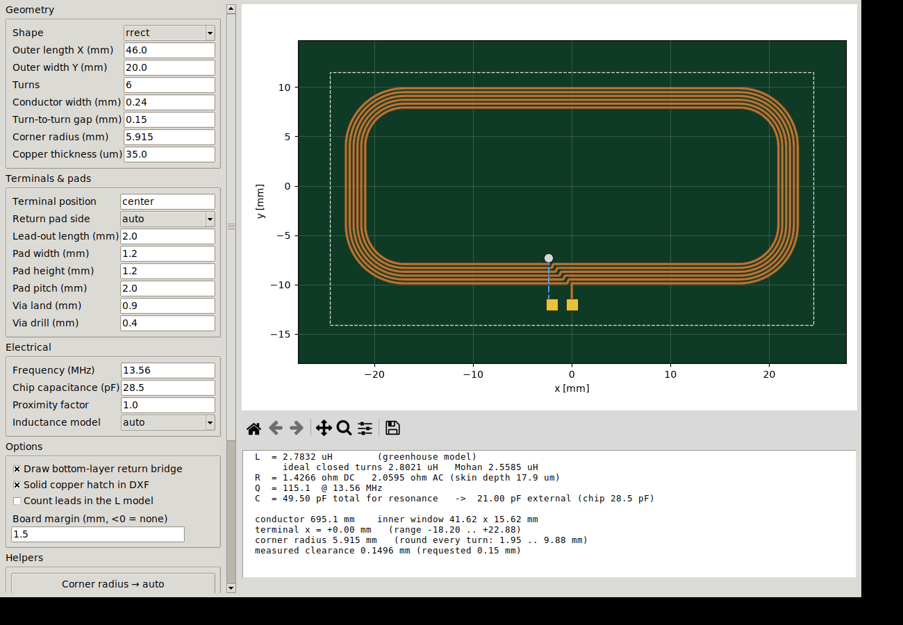
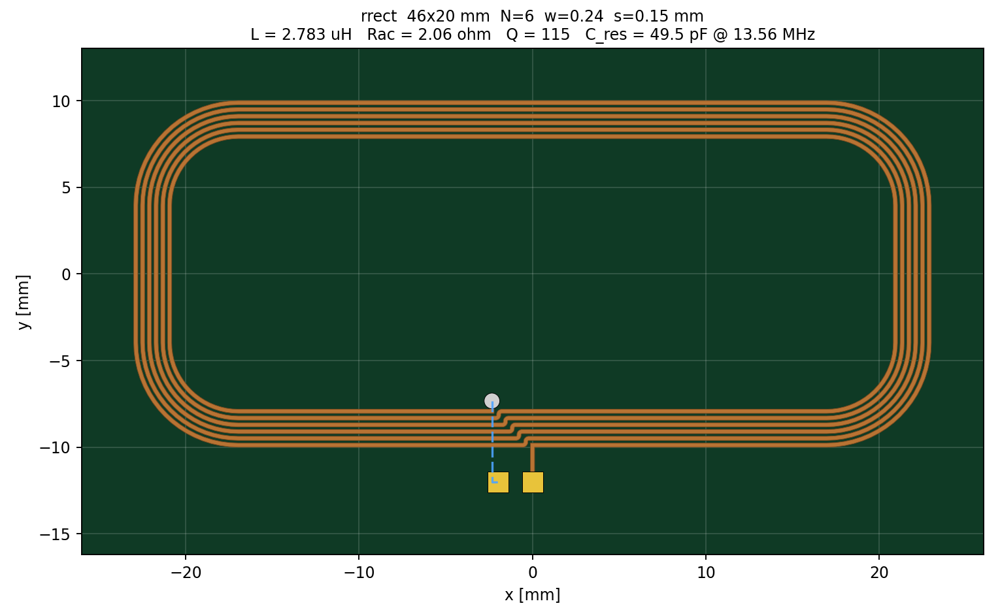
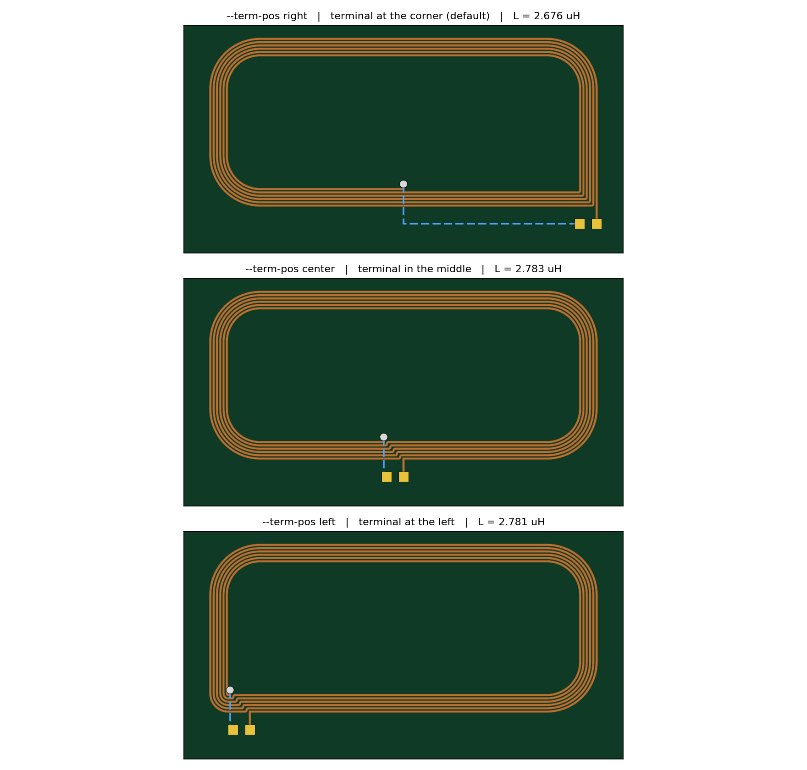
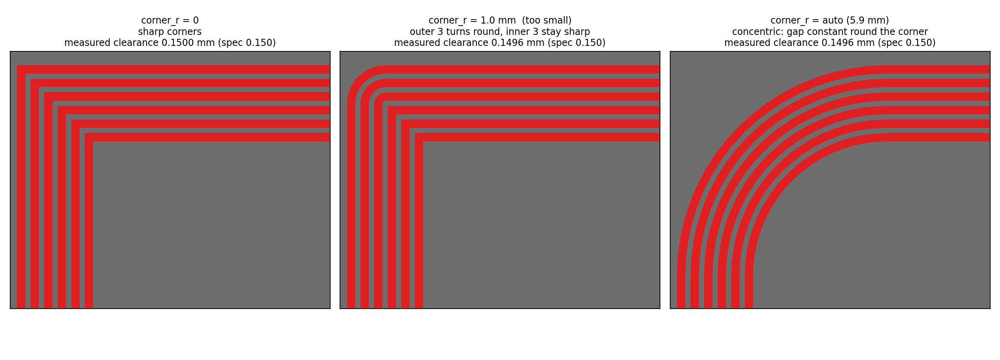

# nfc-spiral-antenna-generator

Parametric planar **NFC / RFID spiral antenna** generator. Give it an outline,
a turn count, a trace width and a gap; it draws the coil, computes its
inductance, checks the copper clearance, and writes **DXF** you can import into
any ECAD tool — plus a ready-to-place KiCad footprint.



Two ways to drive it: a desktop GUI with a live preview, or a command line /
Python API for batch and scripted work. One file each, no packaging, no
framework.

```bash
pip install ezdxf shapely matplotlib
python nfc_spiral_gui.py                       # GUI
python nfc_spiral.py --length 46 --width 20 --turns 6 \
                     --trace 0.24 --gap 0.15 --corner-r auto --term-pos center
```

---

## Table of contents

1. [Why this exists](#1-why-this-exists)
2. [Install](#2-install)
3. [Quick start](#3-quick-start)
4. [The GUI](#4-the-gui)
5. [Command line](#5-command-line)
6. [Python API](#6-python-api)
7. [What it writes](#7-what-it-writes)
8. [Importing into your ECAD tool](#8-importing-into-your-ecad-tool)
9. [Geometry — how the spiral is built](#9-geometry--how-the-spiral-is-built)
10. [Electrical model](#10-electrical-model)
11. [Design guide for 13.56 MHz](#11-design-guide-for-1356-mhz)
12. [Validation and tests](#12-validation-and-tests)
13. [Limitations](#13-limitations)
14. [Troubleshooting](#14-troubleshooting)
15. [Contributing](#15-contributing) · [Licence](#16-licence) · [References](#17-references)

---

## 1. Why this exists

Drawing a six-turn spiral by hand in a PCB editor is twenty minutes of
mouse-work that has to be redone from scratch every time the inductance target
moves. Online calculators give you a number but no geometry. CAD tools give you
geometry but no number.

This gives you both, from one set of parameters, in about a second — and then
checks the result against the two things that actually go wrong in practice:

- **the coil shorting to itself** — a spiral whose step-in segments line up
  fuses adjacent turns, and it is easy to miss on screen;
- **the clearance quietly falling below what your fab can etch** — which
  happens on curved and part-rounded shapes even when the nominal `gap`
  parameter looks fine.

Both are measured on the *drawn* geometry, not assumed from the parameters.

**Scope.** This is an analytical design tool for planar air-core spirals. It
is not a field solver. Expect the inductance to be within roughly 5–10 % of
measurement, and see [Limitations](#13-limitations) for what it does not model.

---

## 2. Install

```bash
git clone https://github.com/<you>/nfc-spiral-antenna-generator.git
cd nfc-spiral-antenna-generator
pip install -r requirements.txt
```

Python 3.8+.

| Package | Needed for | Without it |
|---|---|---|
| `ezdxf` | DXF export | no DXF; KiCad footprint and JSON still written |
| `shapely` | copper outline layer, clearance check | no `ANT_COPPER` layer, no DRC |
| `matplotlib` | PNG preview, GUI canvas | no preview |

Tkinter (for the GUI) ships with CPython on Windows and macOS. On Debian or
Ubuntu it is separate: `sudo apt install python3-tk`.

To check what the Python you are actually running has:

```bash
python nfc_spiral.py --check-deps     # prints the interpreter path and status
python nfc_spiral.py --install-deps   # installs into that same interpreter
```

---

## 3. Quick start

Reproduce the ST reference geometry (46 × 20 mm, 6 turns, 0.24 mm trace,
0.15 mm gap) with rounded corners, a centred terminal, and tuning for a 28.5 pF
tag IC:

```bash
python nfc_spiral.py --length 46 --width 20 --turns 6 --trace 0.24 --gap 0.15 \
                     --corner-r auto --term-pos center --chip-cap 28.5 \
                     --board-margin 1.5 --out my_tag
```

```
==================================================================
 NFC SPIRAL ANTENNA  --  rrect
==================================================================
  outer size ............ 46 x 20 mm
  turns ................. 6
  conductor w / gap ..... 0.24 / 0.15 mm  (pitch 0.39 mm)
  copper thickness ...... 35 um
  inner window .......... 41.62 x 15.62 mm
  conductor length ...... 695.1 mm (647 segments modelled)
  measured clearance .... 0.1496 mm  (requested 0.15 mm)
  terminal .............. x = +0.00 mm on the bottom edge
------------------------------------------------------------------
  INDUCTANCE ............ 2.7832 uH   <-- greenhouse model
    ideal closed turns .. 2.8021 uH  (comparable to ST / textbook calculators)
    Mohan current sheet   2.5585 uH  (independent check)
  R_dc / R_ac ........... 1.4266 / 2.0595 ohm   (skin depth 17.9 um)
  Q @ 13.56 MHz ......... 115.1
  C for resonance ....... 49.50 pF total
  - chip 28.5 pF  ->  external tuning cap 21.00 pF
------------------------------------------------------------------
  FILES WRITTEN:
    dxf        .../output/my_tag.dxf
    kicad_mod  .../output/my_tag.kicad_mod
    png        .../output/my_tag.png
    json       .../output/my_tag.json
==================================================================
```



Do not know the geometry, only the inductance you need? Let it solve:

```bash
python nfc_spiral.py --length 40 --width 30 --trace 0.35 --gap 0.25 --target-l 2.5
```

It sweeps the turn count, prints an L / R / Q / C table, and builds the best one.

---

## 4. The GUI

```bash
python nfc_spiral_gui.py
```

Everything updates as you type — geometry, inductance, Q, tuning capacitor.
Nothing touches the disk until you press an export button.

| Control | What it does |
|---|---|
| **Corner radius → auto** | picks a radius that rounds every turn (see §9.2) |
| **Solve turns for L** | finds the turn count closest to a target inductance |
| **Measure copper clearance** | runs the DRC on the drawn geometry |
| **Export all** | DXF + KiCad footprint + JSON + PNG into a folder you choose |
| **Load settings** | reads back a previously exported `.json` |

The preview uses the standard matplotlib toolbar, so you can pan and zoom into
a corner to inspect it before exporting.

---

## 5. Command line

```
geometry     --shape rect|rrect|octagon|circle
             --length --width --turns --trace --gap
             --corner-r (mm or 'auto') --cu-um
terminals    --term-pos (right|center|left|mm) --pad-side (auto|left|right)
             --lead-out --pad-w --pad-h --pad-pitch --via-pad --via-drill
             --no-bridge
electrical   --freq (MHz) --chip-cap (pF) --model auto|greenhouse|mohan
             --proximity --include-leads --target-l (uH)
output       --out --outdir --board-margin --no-hatch --no-kicad --no-preview
             --force
setup        --check-deps --install-deps
```

All lengths are millimetres.

Every default comes from the `AntennaSpec` dataclass at the top of
`nfc_spiral.py`, so you can edit those fields and run with no arguments at all
— useful when driving it from an IDE's Run button. Command-line values override
the dataclass.

Outputs go to an `output/` folder **next to the script** unless `--outdir` says
otherwise, and the run prints absolute paths, so results never get lost in
whatever the working directory happened to be.

---

## 6. Python API

```python
from nfc_spiral import AntennaSpec, build, solve_turns

spec = AntennaSpec(
    shape="rrect", length=46, width=20, turns=6,
    trace=0.24, gap=0.15, corner_r=5.9,
    term_pos="center", chip_cap_pf=28.5, board_margin=1.5,
)

out = build(spec, outdir="antennas", name="tag_a")
print(out["results"]["L_uH"], out["results"]["C_external_pF"])
print(out["files"]["dxf"])
```

Sweeping a parameter is a loop:

```python
for n in range(3, 12):
    sp = AntennaSpec(length=40, width=25, turns=n, trace=0.3, gap=0.2)
    if [e for e in sp.validate() if e.startswith("error:")]:
        continue
    r = build(sp, outdir="sweep", name=f"n{n}", preview=False, verbose=False)
    print(n, round(r["results"]["L_uH"], 3), round(r["results"]["Q"], 1))
```

Useful entry points:

| Function | Returns |
|---|---|
| `AntennaSpec(...)` | the parameter set; `.validate()` lists problems |
| `build_geometry(spec)` | `Geometry` with `coil`, `top_path`, `bridge`, pads, via |
| `electrical(spec, geo)` | dict of L, R, Q, C, lengths |
| `measure_clearance(pts, trace, gap)` | measured copper clearance in mm |
| `solve_turns(spec, target_uH)` | best turn count for a target inductance |
| `build(spec, outdir, name)` | does everything and writes the files |

`validate()` returns strings prefixed `error:` (not buildable) or `warn:`
(buildable, but you should know).

---

## 7. What it writes

| File | Contents |
|---|---|
| `<name>.dxf` | layered DXF R2010, `$INSUNITS = 4` (mm) so it imports 1:1 |
| `<name>.kicad_mod` | KiCad footprint: real `F.Cu` traces, 2 pads, via |
| `<name>.json` | every parameter and every computed result |
| `<name>.png` | preview render with the key numbers |

### DXF layers

| Layer | Geometry | Use it for |
|---|---|---|
| `ANT_CENTERLINE` | one LWPOLYLINE, `const_width` = trace width | KiCad / Eagle: import, then assign the width |
| `ANT_COPPER` | closed boundary polygons of the etched copper | Altium / EasyEDA / OrCAD: import as regions |
| `ANT_COPPER_HATCH` | solid HATCH of the same region | visual check |
| `ANT_BOTTOM` | bottom-layer return bridge centreline | route on B.Cu |
| `ANT_PADS` | two terminal pad rectangles | pad placement |
| `ANT_VIA` | via land + drill circles | inner-end via |
| `ANT_KEEPOUT` | nominal outer bounding box | keepout rule |
| `BOARD_OUTLINE` | board rectangle (`--board-margin`) | Edge.Cuts |
| `ANT_INFO` | text block with all parameters and results | documentation |

The copper is exported **twice**, as a centreline and as a filled outline,
because different ECAD packages want different things. Import the layer your
tool likes and ignore the rest.

---

## 8. Importing into your ECAD tool

**KiCad** — skip the DXF. Copy `<name>.kicad_mod` into any `.pretty` library
folder and place it: the turns are already `F.Cu` traces at the right width,
pad 1 is the outer terminal, pad 2 is the via plus the bottom-layer return.
If you prefer DXF: *File → Import → Graphics*, layer `F.Cu`, units mm, then
select the polyline and set its width.

**Altium Designer** — *File → Import → DXF/DWG*, units mm, map `ANT_COPPER` to
`Top Layer` and import as **Regions** (not tracks). `BOARD_OUTLINE` →
`Mechanical 1`.

**EasyEDA / LCEDA** — import the DXF, take `ANT_COPPER`, convert to a solid
region on the top layer.

**Eagle** — `ANT_CENTERLINE` imports as wires; select all and set the width.

**Anything else** — `ANT_COPPER` is a plain set of closed polygons and lands
correctly everywhere.

After importing, place a via at the `ANT_VIA` position and route the
bottom-layer return (`ANT_BOTTOM`) to the second pad.

---

## 9. Geometry — how the spiral is built

### 9.1 The break, and why the terminal position moves it

A spiral has to break somewhere to step inward, and the outer terminal can only
leave the coil **at that break** — anywhere else it would have to cross its own
outer turn on the same layer.

So `--term-pos` does not just move a pad. The whole step-in staircase moves with
it, stepping one pitch left per turn. That stagger is essential: if the step
segments ever shared an x coordinate they would stack into a vertical bar that
shorts every turn together.



Centring the terminal is usually the better choice, and not only for layout:

| `--term-pos` | bottom-layer bridge | L | Q |
|---|---|---|---|
| `right` (default) | 25.6 mm | 2.676 µH | 109 |
| `center` | **5.0 mm** | 2.783 µH | 115 |
| `left` | 5.0 mm | 2.781 µH | 114 |

The return bridge runs from the inner via to the second pad. With the terminal
at a corner it has to travel half the length of the coil underneath the turns;
centred, it is a single via-to-pad hop. Less parasitic coupling between the
return path and the coil, and a slightly higher Q. Inductance also rises a
little, because the outer turn no longer loses the section the corner break used
to consume.

The feasible range is printed in the report and clamped automatically.

### 9.2 Rounded corners are concentric, not constant

`--corner-r` fillets the corners, but the radii **shrink by one pitch per turn**:
turn *i* gets `corner_r - i × pitch`. All four corner arcs of the whole coil
therefore share one centre per corner, and the turn-to-turn gap stays exactly
`--gap` the whole way round.



A *constant* radius on every turn — what a quick fillet script does — opens the
corner gap to `pitch × √2` on the diagonal and wastes board area.

The counter-intuitive part is that the radius must be **large enough**, not small
enough. It decreases as the spiral works inward, so it has to start at least
`(N-1) × pitch` above zero or the innermost turns fall back to sharp corners
(middle panel above). For the 46 × 20 / 6-turn example that lower bound is
1.95 mm and the largest that fits is 9.88 mm; the script prints both and warns
if you land outside. `--corner-r auto` picks the midpoint.

Partial rounding is a cosmetic and etch-consistency issue, not a clearance one:
a fillet cuts a corner away, so it can only move copper further apart. A test
asserts exactly that.

### 9.3 Round shapes must be square

`circle` and `octagon` are rejected on a non-square outline (aspect > 1.02),
because concentric circles only keep a constant gap when they are not stretched.
Stretch a 6-turn octagon to 46 × 20 and the measured clearance falls from
0.149 mm to 0.042 mm — a near short:

| aspect | octagon | circle |
|---|---|---|
| 1.00 | 0.1495 | 0.1500 |
| 1.15 | 0.1394 | 0.1479 |
| 1.64 | 0.1000 | 0.1320 |
| 2.30 | 0.0422 | 0.1032 |

For an elongated rounded coil use `--shape rrect` with a large `--corner-r`,
which is exact at any aspect ratio.

There is a second, subtler effect on faceted shapes. A polygon inscribed on a
spiral has its **edges** closer together than its vertices: the chord midpoint
sits at `r·cos(π/n)`, so a radial step of `pitch` only buys `pitch·cos(π/n)` of
edge-to-edge spacing. An octagon loses 8 % of the gap that way — the difference
between passing and failing a 0.15 mm rule. The generator divides it back out
(`radial_pitch = pitch / cos(π/n)`) so the *drawn* clearance is the clearance you
asked for.

### 9.4 The clearance check

After drawing, `measure_clearance()` computes the smallest distance between any
two segments that are far apart *along the conductor* but close in space — that
is, between different turns, not between neighbouring segments of the same turn,
which are always close near their shared corner. An STRtree keeps it fast.

This is a real DRC number measured on the drawn geometry, not the nominal
parameter. `build()` warns when it comes out below the requested gap.

---

## 10. Electrical model

### Inductance

**Greenhouse / Grover partial-inductance summation.** The centreline is cut
into straight segments. Each contributes a self-inductance computed from the
geometric mean distance of the `w × t` copper bar (GMD = 0.2235·(w+t)), and
every parallel pair contributes a mutual term from the exact closed form for two
parallel filaments:

```
M = (μ₀/4π) · [ Q(b₁−a₂) + Q(a₁−b₂) − Q(b₁−b₂) − Q(a₁−a₂) ]
Q(x) = x·asinh(x/d) − √(x² + d²)
```

with `+` for co-directed current and `−` for counter-directed, `d` the
perpendicular distance between the two filament axes.

Orthogonal segments have zero mutual inductance, so this sum is **exact for
rectangular spirals** — the same method ST's NFC inductance tool uses.

For round and octagonal coils the parallel-only sum drops a large positive term,
so `--model auto` switches those to the **Mohan current-sheet** expression:

```
L = (μ₀ n² d_avg c₁ / 2) · [ ln(c₂/ρ) + c₃ρ + c₄ρ² ]
d_avg = (d_out + d_in)/2      ρ = (d_out − d_in)/(d_out + d_in)
```

The report always names which model produced the headline number.

Three inductances are printed:

- **as-drawn** — the real path, including the break in the outer turn. This is
  what you will measure on the bench.
- **ideal closed turns** — N perfectly closed rectangles, a few percent higher.
  This is the number comparable to ST's calculator and to textbook formulas.
- **Mohan current sheet** — a fully independent check.

### Resistance and Q

DC from `ρ·l/(w·t)`. For AC, a smooth conducting-shell model with an effective
penetration depth per dimension that saturates at half the dimension, so it
degrades gracefully to `R_dc` at low frequency:

```
δ  = √(ρ / (π f μ₀))                       (17.9 µm in copper at 13.56 MHz)
δ_t = δ·(1 − e^(−t/2δ))     δ_w = δ·(1 − e^(−w/2δ))
A   = w·t − max(w−2δ_w, 0)·max(t−2δ_t, 0)
```

At 13.56 MHz the skin depth is about half of 35 µm copper, so a 1 oz trace is
only partly used — R_ac is roughly 1.4× R_dc for a typical tag coil.

**Proximity effect between tightly-pitched turns is not modelled.** For
`gap < trace`, multiply by 1.3–2.0 with `--proximity` if you want a realistic Q.

### Tuning

`C_total = 1/(ω²L)` at the carrier. With `--chip-cap` you also get the external
capacitor: `C_ext = C_total − C_chip`. If the chip capacitance alone already
exceeds the resonating value, the report says so — the coil needs to be smaller.

---

## 11. Design guide for 13.56 MHz

- **Enclosed area drives coupling far more than turn count.** Make the loop as
  large as the product allows before adding turns.
- Typical **tag** coils land at 2–5 µH; **reader** coils at 0.3–2 µH.
  `--target-l` gets you there in one shot.
- Keep the **inner window** open. The script reports it and warns when turns
  start choking it.
- **Keep ground and power pours off both layers under the coil**, or Q
  collapses. `ANT_KEEPOUT` is exported so you can build the rule from it.
- If the antenna sits on or near **metal**, a ferrite sheet between them is not
  optional — and it will raise L by 20–80 %, so retune afterwards.
- **Trim on the bench.** Analytical planar-spiral inductance is ±5–10 %; the
  substrate, the enclosure and the reader loading move it further than that.
- Centre the terminal (§9.1) to keep the bottom-layer return short.
- Round the corners (§9.2) for etch consistency and to reduce current crowding
  at sharp inside corners.

---

## 12. Validation and tests

```bash
pytest -q tests/          # 59 tests
```

The suite checks the model against results that exist independently of this
code, and checks every generated coil for the failure modes that matter.

| Case | This code | Reference |
|---|---|---|
| Closed 19.76 mm square loop, 0.24 mm trace | 79.1 nH | 75.1 nH (Grover closed form) |
| ST example, idealised 24-segment model | 2.802 µH | 2.9 µH (ST NFC tool) |
| ST example, as actually drawn | 2.676 µH | — |
| Mohan cross-check, same geometry | 2.559 µH | — |

The spread against Grover is expected: his constant carries the DC internal
inductance of a round wire, which a flat bar modelled by its GMD does not have.

Geometry tests run every shape × five terminal positions and assert that the
copper is **one connected piece with no enclosed islands** (the short-circuit
check) and that the **measured clearance meets the requested gap**. Further
tests cover concentric corner arcs, the polygon chord compensation, the
aspect-ratio rejection, DXF layer presence, a full `ezdxf` audit, and balanced
s-expressions in the KiCad footprint.

CI runs the suite on Python 3.9–3.12 on every push.

---

## 13. Limitations

Worth knowing before you trust a number:

- **Analytical, not a field solver.** No substrate permittivity, no ground
  plane, no nearby metal, no ferrite. All of those move the inductance more than
  the model's own error does.
- **Proximity effect is not modelled** (see §10). Q is optimistic for tight
  pitches; use `--proximity`.
- **Self-capacitance is not modelled**, so no self-resonant frequency is
  reported. For typical 13.56 MHz tag coils the SRF is far above the carrier,
  but a many-turn fine-pitch coil can get close.
- **Round shapes must be square** (§9.3).
- The **Greenhouse sum is exact only for orthogonal geometry**; round coils fall
  back to Mohan, which is a fitted expression good to roughly ±8 % in its range.
- Only a **single-layer coil with a bottom-layer return** is generated. No
  multi-layer stacked coils, no differential/symmetric layouts.
- The KiCad footprint puts the turns on `F.Cu` as graphic lines, which is the
  practical way to place an antenna but means they are not net-aware traces.

---

## 14. Troubleshooting

**"the last N turn(s) keep sharp corners"** — your `corner_r` is too small. It
shrinks one pitch per turn; see §9.2 and use `--corner-r auto`.

**"needs a square outline"** — see §9.3; use `rrect` with a large `corner_r`.

**"drawn clearance is below the requested gap"** — the DRC measured a real
shortfall on curved geometry. Raise `--gap`, or raise `circle_segments` in the
dataclass to reduce the faceting error.

**GUI will not start: `No module named 'tkinter'`** —
`sudo apt install python3-tk` on Debian/Ubuntu; on Windows/macOS reinstall
Python with the Tcl/Tk option ticked.

---

## 15. Contributing

Issues and pull requests welcome. Please run `pytest -q tests/` before opening
a PR, and add a test for any geometry change — the short-circuit and clearance
tests are the ones that keep this trustworthy.

Ideas that would be genuinely useful:

- true offset-curve generation so elongated round shapes work
- a proximity-effect model for tight pitches
- self-capacitance and an SRF estimate
- Gerber output alongside DXF
- multi-layer stacked coils

## 16. Licence

MIT — see [LICENSE](LICENSE).

## 17. References

- H. M. Greenhouse, "Design of Planar Rectangular Microelectronic Inductors,"
  *IEEE Trans. Parts, Hybrids, and Packaging*, vol. 10, no. 2, pp. 101–109, 1974.
- F. W. Grover, *Inductance Calculations: Working Formulas and Tables*, Dover,
  1946.
- S. S. Mohan, M. del Mar Hershenson, S. P. Boyd, T. H. Lee, "Simple Accurate
  Expressions for Planar Spiral Inductances," *IEEE J. Solid-State Circuits*,
  vol. 34, no. 10, pp. 1419–1424, 1999.
- NXP AN11276, *NFC antenna design guide*.
- STMicroelectronics AN2972 / the ST25 NFC inductance calculator, used as the
  cross-check for the reference geometry.
- ISO/IEC 14443 and ISO/IEC 15693 (13.56 MHz proximity and vicinity cards).
